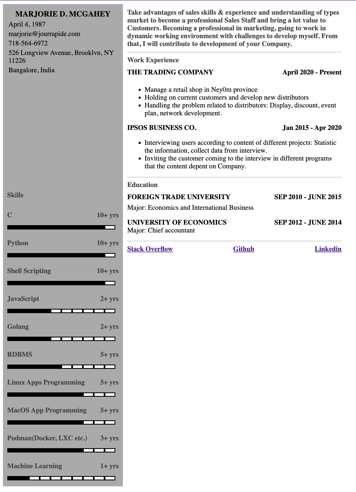

# two-column-cv
Alternate for latex based two column CV format.
Idea is create left and right sections separately, and combine it using html.

Update `left.md`, `right.md`, and `skills.txt`, and just execute `python md2html.py`.
It will update `index.html` and that can be printed into pdf etc. 

